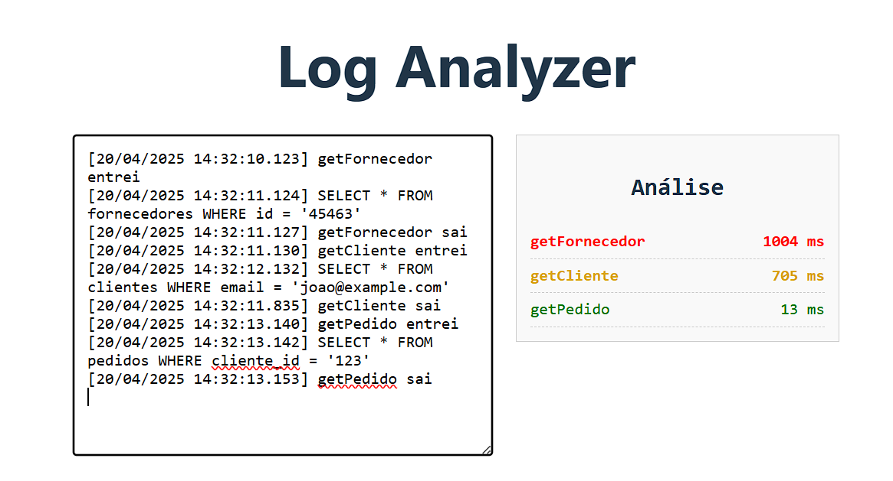

# log-analyzer-vue



Este projeto foi criado com o objetivo de estudar Vue.js e testar a viabilidade de facilitar o processo de análise de possíveis lentidões no sistema da empresa onde trabalho.

## Como executar localmente:

1. Clone este repositório:

   ```bash
   git clone https://github.com/PatrickGimenes/log-analyzer-vue

   ```

2. Acesse a pasta do projeto:
   ```bash
   cd log-analyzer-vue
   ```
3. Instale as dependências:
   ```bash
   npm install
   ```
4. Execute o servidor de desenvolvimento:
   ```bash
   npm run dev
   ```
5. Use o log de exemplo na pasta example.
